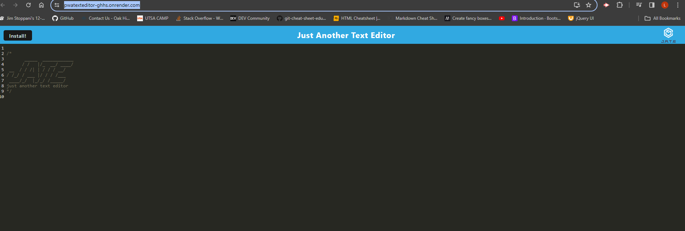

# PWATextEditor
    
## Description:

-This project showcases our use of PWA to cache and render certain files that we want so we could use this offline or without some of the source.
    
## Table of Contents:

- [Description](#description)
- [Installation](#installation)
- [Usage](#usage)
- [Credits](#credits)
- [License](#license)
- [Tests](#tests)
- [Questions](#questions)

## Installation:

To install and run this project, you will need to run seeds and npm install in our root folder, and npm run start

## Usage:

Edit text, and have it save to local storage.

## Credits:

Cody Thompson, with help from learning assistant, Bijan Olfati and Jason Mason.

## License:

n/a

## Tests:

No Tests.

## Questions:

Contact Information

Github Link: https://github.com/codyleight

Screenshot preview: 

Email: codylthomp@gmail.com

